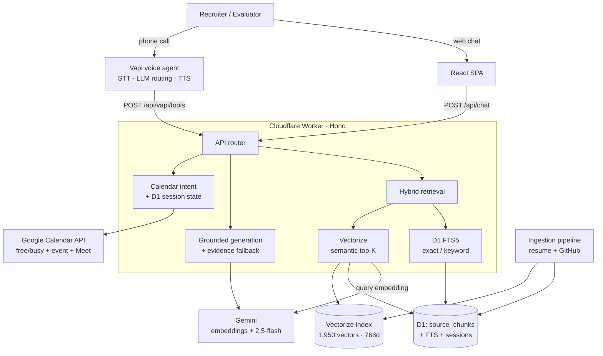

# AI Persona — Voice and Chat Interview Agent

A live AI representative that can be **called** and **chatted with** to answer questions about my background, projects, and GitHub repositories, and to **book a real interview** — end to end, with no human in the loop. Every factual answer is RAG-grounded over the actual resume and public GitHub corpus.

| Interface | Link |
| --- | --- |
| Chat (production) | https://ai-persona.vanshjain05.workers.dev |
| Chat (development) | https://ai-persona-development.vanshjain05.workers.dev |
| Voice agent | Vapi phone number (see submission form) |

---

## What it does

- **Answers grounded questions** about resume, experience, skills, and any public GitHub repo — tech stack, purpose, design tradeoffs, even commit history.
- **Stays honest under pressure**: if the evidence does not support an answer, it says so instead of inventing. Prompt-injection and fake-project probes are refused.
- **Books interviews autonomously**: checks real Google Calendar free/busy, proposes slots, confirms the email, and creates a confirmed event with a Google Meet link.
- **Two interfaces, one backend**: chat and voice share the same retrieval, grounding, and calendar logic, so they never contradict each other.

## Architecture



**Flow:** both interfaces hit one Cloudflare Worker. For a factual question it runs **hybrid retrieval** — D1 FTS5 (exact/keyword: repo names, files, commits) plus Cloudflare Vectorize (semantic, Gemini embeddings) — merges, de-dupes, and scopes the evidence, then asks Gemini 2.5-flash to answer **only** from that evidence. If generation fails, a deterministic evidence fallback keeps the answer grounded. Calendar messages are intercepted before RAG and handled deterministically against Google Calendar.

## Tech stack

| Layer | Technology |
| --- | --- |
| Frontend | React 19 + Vite + TypeScript |
| Backend | Cloudflare Workers + Hono |
| Exact retrieval | Cloudflare D1 (SQLite) + FTS5 |
| Semantic retrieval | Cloudflare Vectorize (768-dim, cosine) |
| Embeddings | Gemini `gemini-embedding-001` |
| Generation | Gemini `gemini-2.5-flash` (thinking disabled) |
| Voice | Vapi (Deepgram STT + TTS) |
| Calendar | Google Calendar API (OAuth refresh token) |

## RAG corpus

Indexed from the real resume and **all public GitHub repos** (`nexxucc`), with a curation overlay (`sources/github-repository-overrides.json`) that promotes canonical projects and excludes toy/duplicate repos:

| Source type | Chunks |
| --- | --- |
| github_manifest | 405 |
| github_readme | 327 |
| github_repository | 301 |
| github_document | 290 |
| github_commit | 79 |
| resume | 10 |
| **Total** | **1,412 chunks → 1,950 vectors** |

## Setup

```bash
# 1. Install
npm install

# 2. Local secrets — copy and fill in
cp .dev.vars.example .dev.vars
#   GEMINI_API_KEY, GEMINI_API_KEYS (comma-separated for quota rotation),
#   GOOGLE_CLIENT_ID / SECRET / REFRESH_TOKEN, GOOGLE_*_CALENDAR_ID,
#   GOOGLE_DEFAULT_TIMEZONE, VAPI_WEBHOOK_SECRET

# 3. Database schema
npx wrangler d1 migrations apply persona-db-dev --remote --env development

# 4. Ingest corpus (preview → SQL → import → embed → upsert)
npm run ingest:resume:preview
npm run ingest:github:preview
npm run ingest:corpus:prepare-sql
npm run vector:chunks:export
npm run vector:embeddings:generate
npm run vector:upsert:dev

# 5. Run / deploy
npm run dev                                              # local
npm run build && npx wrangler deploy --env development \
  --config wrangler.json                                # deploy dev worker
npm run build && npx wrangler deploy                    # deploy prod worker
```

Deployed workers store secrets via `wrangler secret put` / `wrangler secret bulk` (not `.dev.vars`). The Vapi assistant configuration (voice, prompt, tool schemas, email-confirmation rules) is version-controlled in [`vapi/assistant.md`](vapi/assistant.md).

## Cost breakdown

Measured token usage; Gemini priced at paid `gemini-2.5-flash` rates ($0.30 / 1M input, $2.50 / 1M output) for reference — the live deploy currently runs on the free tier with multi-key rotation, so marginal cost is effectively **$0**.

| Unit | Gemini | Cloudflare | Vapi | Approx. total |
| --- | --- | --- | --- | --- |
| **Per chat turn** | ~1 embedding + 1 generation (~3k in / ~250 out ≈ $0.0015) | Worker + D1 + Vectorize within free tier (~$0) | — | **~$0.0015** (free tier: $0) |
| **Per voice call** (≈4 min, a few tool calls) | ~3–5 tool generations (~$0.006) | ~$0 | STT+LLM+TTS ≈ $0.05–0.10/min ⇒ **$0.20–0.40** | **~$0.21–0.41** (dominated by Vapi minutes) |

## Evaluation

Measured on the live worker with a 12-item golden Q&A set ([`scripts/eval/`](scripts/eval/)):

- **Groundedness 91.7%**, **hallucination rate 0%**, adversarial/injection refusal **100%**.
- **Retrieval recall@5 88.9%**; **LLM fallback rate 0%** (quota rotation + thinking disabled).
- Chat latency p50 **3.4s**; voice `answer_question` median **~3.1s**, `get_availability` **~1s**.
- Booking task completion **3/3**, each with a Google Meet link + emailed invite.

## Repository layout

```
src/worker/        Hono API: retrieval, chat, voice, calendar
src/react-app/     Chat UI
scripts/ingest/    Resume + GitHub ingestion pipeline
scripts/embedding/ Embedding generation + Vectorize upsert
scripts/eval/      Grounded-chat evaluation harness + golden set
migrations/        D1 schema (corpus + chat sessions)
vapi/              Version-controlled Vapi assistant config
docs/              Architecture, status, eval report
```
