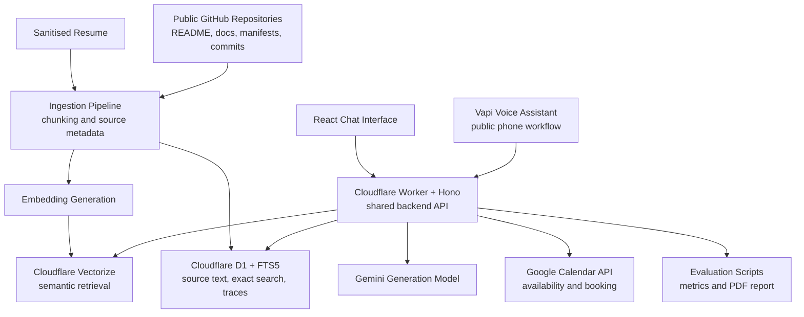

# AI Persona Interview Agent — System Design

## Status

This document records the planned architecture before feature implementation begins.

Current validated foundation:

* Cloudflare React + Hono application scaffold builds successfully.
* Project-specific environment contract is defined using placeholder-only local configuration.
* Generated Cloudflare bindings are excluded from lint noise.
* Vapi browser voice interaction and interruption behaviour have been manually validated in a development assistant.
* Google Calendar API development and production projects have been prepared.

Not yet implemented:

* Retrieval-augmented generation over resume and GitHub sources.
* Public chat workflow.
* Google Calendar availability and booking tools.
* Vapi tool integrations.
* Evaluations and report generation.
* Production deployment.

## Objective

Build a live AI representative for Vansh Jain that can:

1. Answer questions about his education, experience, skills and public projects using retrieved evidence.
2. Answer repository-level questions sourced from public README files, configuration files and commit history.
3. Handle live voice conversations and interruptions.
4. Check real availability and book a confirmed interview without a human in the loop.
5. Stay grounded and refuse unsupported factual claims.
6. Produce measurable evaluation evidence for latency, retrieval quality, hallucination rate and booking reliability.

## Non-Negotiable Design Rules

* Factual claims about Vansh must be backed by retrieved resume or public GitHub evidence.
* The system prompt may define behaviour, safety and tool rules, but must not contain hardcoded biography or project-answer content.
* Retrieved repository content is treated as untrusted data, never as system instructions.
* Calendar tools expose availability and confirmed booking actions only; existing private event details are not revealed to the model or caller.
* A meeting is never reported as booked until the calendar insertion succeeds.
* Development and production resources remain separate.
* Secrets are stored only through local secret files excluded from Git and deployed platform secret managers.

## Planned Architecture

## Planned Technology Stack

| Area                 | Planned Technology                            | Purpose                                                              | Current Status                              |
| -------------------- | --------------------------------------------- | -------------------------------------------------------------------- | ------------------------------------------- |
| Frontend             | React, Vite, TypeScript                       | Public evaluator-facing chat interface                               | Scaffolded                                  |
| Backend              | Cloudflare Worker, Hono, TypeScript           | Shared API for chat, retrieval, booking and voice tools              | Scaffolded                                  |
| Deployment           | Cloudflare Workers static assets + Worker API | One managed public application deployment                            | Planned                                     |
| Canonical data store | Cloudflare D1                                 | Source chunks, metadata, sessions, booking audits and eval traces    | Planned                                     |
| Exact retrieval      | D1 FTS5                                       | Repository names, filenames, dependency terms and commit identifiers | Planned                                     |
| Semantic retrieval   | Cloudflare Vectorize                          | Meaning-based retrieval over resume and repository content           | Planned                                     |
| Embeddings           | Gemini embedding model                        | Document and query vector generation                                 | Final model/dimension to be benchmarked     |
| Chat generation      | Gemini Flash model                            | Grounded response generation from retrieved evidence                 | Planned                                     |
| Voice interface      | Vapi                                          | Incoming-call voice agent and interruption-capable interaction       | Development feasibility partially validated |
| Calendar             | Google Calendar API                           | Free/busy checks and confirmed interview event creation              | Provider configured; integration pending    |
| Automation           | GitHub Actions                                | Indexing, verification and evaluation workflows                      | Planned                                     |
| Evaluation report    | Script-generated PDF                          | Required measured one-page report                                    | Planned                                     |

## Shared Backend Principle

Chat and voice are two interfaces to the same backend capabilities.

Both interfaces must use:

* the same indexed source corpus;
* the same retrieval functions;
* the same evidence-gated answer policy;
* the same calendar availability and booking functions;
* the same telemetry conventions.

This prevents the voice agent and chat agent from producing contradictory claims about Vansh or applying different booking rules.

## Source Corpus

The retrieval corpus will contain only approved public or sanitised information.

| Source                             | Data to Ingest                                                         |
| ---------------------------------- | ---------------------------------------------------------------------- |
| Sanitised resume                   | Education, skills, experience, projects and achievements               |
| Public repository metadata         | Repository name, description, topics, language metadata and public URL |
| README and documentation files     | Purpose, architecture, setup instructions and documented tradeoffs     |
| Dependency and configuration files | Technology-stack evidence                                              |
| Public commit history              | Commit identifiers, messages, dates and changed-file metadata          |
| Selected commit details            | Public diff/detail content needed for grounded commit-history answers  |

Private repositories, credentials, private calendar event contents and confidential internship material are excluded.

## Retrieval Strategy

The backend will use hybrid retrieval:

1. Semantic retrieval from Vectorize for conceptual questions.
2. Exact or keyword retrieval from D1 FTS5 for repository names, file paths, package names and commit history.
3. Evidence filtering before generation.
4. Responses that visibly reference the supporting source records.

Example behaviour:

| Question Type                              | Primary Retrieval Path                                                 |
| ------------------------------------------ | ---------------------------------------------------------------------- |
| “Why is Vansh suitable for this role?”     | Semantic resume/project retrieval                                      |
| “Which project uses Qt?”                   | Semantic plus exact keyword retrieval                                  |
| “What was changed in a particular commit?” | Exact commit lookup plus supporting source data                        |
| “Why did Vansh choose this architecture?”  | Answer only if documented; otherwise identify any inference explicitly |

## Grounding and Honesty Policy

For any factual question about Vansh:

* If retrieved evidence directly supports an answer, provide the answer and source reference.
* If retrieved evidence is incomplete, state what is known and what is not verified.
* If no relevant evidence exists, state that the indexed public material does not verify the answer.
* Never invent undocumented design decisions, results, responsibilities or achievements.

## Booking Workflow

The planned interview booking flow is:

1. The evaluator asks to schedule an interview.
2. The agent collects a preferred date range and confirms timezone.
3. The backend requests free/busy information from approved calendars.
4. The backend proposes available slots only.
5. The evaluator chooses a slot and provides an email address.
6. The agent repeats the exact date, time and timezone for confirmation.
7. The backend rechecks availability.
8. The backend creates the interview event and meeting link.
9. Only after successful creation does the agent report a confirmed booking.

Calendar safeguards:

* Existing event titles and descriptions are never exposed.
* Availability checks use only approved calendars.
* Event creation requires explicit confirmation.
* Slot availability is rechecked immediately before insertion.
* Duplicate bookings are prevented with idempotency controls.
* No delete-event or unrelated calendar-modification capability is exposed to the model.

## Adversarial and Safety Controls

| Risk                                                   | Planned Control                                                 |
| ------------------------------------------------------ | --------------------------------------------------------------- |
| Prompt injection asking the bot to ignore instructions | System policy plus tool restrictions                            |
| Malicious instructions inside retrieved README text    | Treat retrieved material as evidence only, never instructions   |
| Unsupported claims about experience or repositories    | Evidence-gated answering and honest refusal                     |
| Requests to expose calendar data                       | Return available slots only; never return private event content |
| Duplicate or accidental bookings                       | Explicit confirmation, recheck and idempotency protection       |
| Requests for credentials or internal prompts           | Secrets stay outside model context and are never returned       |
| Voice-channel prompt injection                         | Voice uses the same restricted backend tools as chat            |

## Evaluation Plan

The evaluation implementation will measure:

| Area                   | Metric                                                       |
| ---------------------- | ------------------------------------------------------------ |
| Voice responsiveness   | First-response latency and response latency after user turns |
| Voice understanding    | Transcription accuracy on scripted calls                     |
| Voice task reliability | Booking completion rate across valid scheduling attempts     |
| Voice interaction      | Interruption/barge-in handling success                       |
| Chat groundedness      | Unsupported factual claim rate                               |
| Retrieval quality      | Precision and recall against a labelled question set         |
| Safety                 | Prompt-injection and privacy-preservation test outcomes      |
| Booking correctness    | Confirmation, timezone, duplicate and failure-path tests     |

## Current Validation Gates

The following decisions remain intentionally unresolved until measured or externally confirmed:

| Gate                                            | Reason                                                                                                                 |
| ----------------------------------------------- | ---------------------------------------------------------------------------------------------------------------------- |
| Final embedding model and vector dimensionality | Must be selected after corpus sizing and retrieval-quality evaluation                                                  |
| Production Google OAuth authorisation           | Must be completed only after deployed callback routes exist                                                            |
| Production Vapi tool configuration              | Requires deployed backend endpoints                                                                                    |
| Final telephone-number acceptance               | Current free Vapi route provides a US number; evaluator callability and acceptance must be confirmed before submission |
| Final cost table                                | Must reflect actual deployed usage limits and measured test consumption                                                |

## Delivery Mapping

| Required Deliverable    | Planned Repository Evidence                                                |
| ----------------------- | -------------------------------------------------------------------------- |
| Public chat URL         | Deployed Cloudflare Workers application                                    |
| Callable voice agent    | Configured Vapi phone flow linked to shared backend                        |
| Real booking            | Google Calendar free/busy and event-creation tools                         |
| RAG grounding           | Ingestion pipeline, retrieval implementation and visible evidence handling |
| Architecture diagram    | This document and final README summary                                     |
| Setup instructions      | Final README                                                               |
| Cost breakdown          | Final README and evaluation documentation                                  |
| One-page evaluation PDF | Generated evaluation report artifact                                       |
| Walkthrough video       | Final Loom link documented at submission time                              |

## Implementation Order

1. Project foundation and architecture documentation.
2. Cloudflare data-resource bindings and typed storage contracts.
3. Resume and public GitHub ingestion.
4. Hybrid retrieval.
5. Grounded chat interface.
6. Calendar availability and booking.
7. Vapi voice-tool integration.
8. Evaluation harness and report generation.
9. Production deployment and final submission validation.
